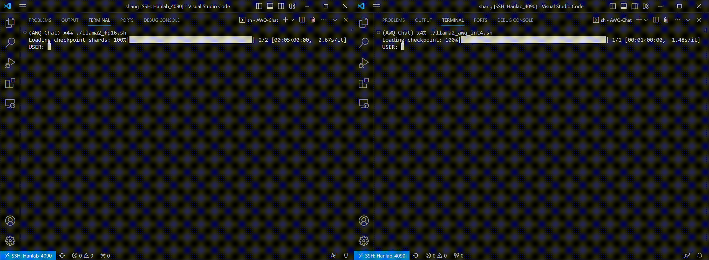

# TinyChat: Efficient and Minimal Chatbot with AWQ

We introduce TinyChat, a cutting-edge chatbot interface designed for minimal resource consumption and fast inference speed on GPU platforms. It allows for seamless deployment on consumer-level GPUs such as 3090/4090 and low-power edge devices like the NVIDIA Jetson Orin, empowering users with a responsive conversational experience like never before.


The current release supports:

- LLaMA-2-7B/13B-chat;

- Vicuna;

- MPT-chat;

- Falcon-instruct.


## Contents

- [Examples](#examples)

- [Usage](#usage)

- [Reference](#reference)


## Examples

Thanks to AWQ, TinyChat can now deliver more prompt responses through 4-bit inference. The following examples showcase that TinyChat's W4A16 generation is 2.3x faster on RTX 4090 and 1.4x faster on Jetson Orin, compared to the FP16 baselines. (Tested with [LLaMA-2-7b]( https://huggingface.co/meta-llama/Llama-2-7b-chat-hf ) model.)

* TinyChat on RTX 4090:



* TinyChat on Jetson Orin:


## Usage

1. Please follow the [AWQ installation guidance](https://github.com/mit-han-lab/llm-awq#readme) to install AWQ and its dependencies.

2. Download the pretrained instruction-tuned LLMs:
   
   - For LLaMA-2-chat, please refer to [this link](https://huggingface.co/meta-llama/Llama-2-7b-chat-hf);
   
   - For Vicuna, please refer to [this link](https://huggingface.co/lmsys/);
   
   - For MPT-chat, please refer to [this link](https://huggingface.co/mosaicml/mpt-7b-chat);
   
   - For Falcon-instruct, please refer to [this link](https://huggingface.co/tiiuae/falcon-7b-instruct).


3. Quantize instruction-tuned LLMs with AWQ:

- We provide pre-computed AWQ search results for multiple model families, including LLaMA, OPT, Vicuna, and LLaVA. To get the pre-computed AWQ search results, run:

```bash
# git lfs install  # install git lfs if not already
git clone https://huggingface.co/datasets/mit-han-lab/awq-model-zoo awq_cache
```

- You may run a one-line starter below:

```bash
./scripts/llama2_demo.sh
```

Alternatively, you may go through the process step by step. We will demonstrate the quantization process with LLaMA-2. For all other models except Falcon, one only needs to change the `model_path` and saving locations. For Falcon-7B, we also need to change `q_group_size` from 128 to 64.

- Perform AWQ search and save search results (we already did it for you):

```bash
mkdir awq_cache
python -m awq.entry --model_path /PATH/TO/LLAMA2/llama-2-7b-chat \
    --w_bit 4 --q_group_size 128 \
    --run_awq --dump_awq awq_cache/llama-2-7b-chat-w4-g128.pt
```

- Generate real quantized weights (INT4):

```bash
mkdir quant_cache
python -m awq.entry --model_path /PATH/TO/LLAMA2/llama-2-7b-chat \
    --w_bit 4 --q_group_size 128 \
    --load_awq awq_cache/llama-2-7b-chat-w4-g128.pt \
    --q_backend real --dump_quant quant_cache/llama-2-7b-chat-w4-g128-awq.pt
```

4. Run the TinyChat demo:

```bash
cd tinychat
python demo.py --model_type llama \
    --model_path /PATH/TO/LLAMA2/llama-2-7b-chat \
    --q_group_size 128 --load_quant quant_cache/llama-2-7b-chat-w4-g128-awq.pt \ 
    --precision W4A16
```

Note: if you use Falcon-7B-instruct, please remember to also change `q_group_size` to 64. You may also run the following command to execute the chatbot in FP16 to compare the speed and quality of language generation:

```bash
python demo.py --model_type llama \
    --model_path /PATH/TO/LLAMA2/llama-2-7b-chat \
    --precision W16A16
```


## Reference

TinyChat is inspired by the following open-source projects: [FasterTransformer](https://github.com/NVIDIA/FasterTransformer), [vLLM](https://github.com/vllm-project/vllm), [FastChat](https://github.com/lm-sys/FastChat).


